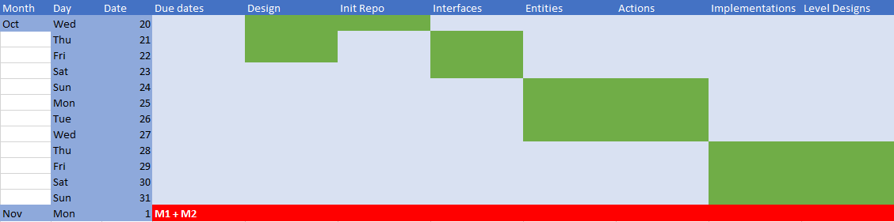

# Dungeon Assignment Planning

## Git Commits

-   Commit names have a structure
    -   { status }: { work }
    -   E.g. “Tests: Entity framework” or “Review: Adding ” or “Docs: project management”
  -   Status:
	  -   Stubs - Classes without any functionality
	   -   Tests - failing unit tests
	   -   Functionality - that causes unit tests to pass
	    -   Review - changes as a result of the review
	    -   Refactor - changes after a merged pull request to refactor previous code (no new tests)
	    -   Docs - changes to the non-code aspects of the assignment
	    -   Conflicts - fixing merge conflicts
    

## Pull Requests

-   All code changes go through Pull Requests
-   They are attached to a git issues on our Kanban
   -   A developer would
	   -   First write failing unit tests
	   -   Followed by functionality that causes the tests to pass
	   -   Then submit it for review
   -   Once a task is ready for review, another team member would take a look
   -   Any design/refactoring would create a quality iteration
    -   that PR would go back to development
    -   Once the PR is approved, it is merged to the main branch

## Kanbans and Sprints
-   Standard sprint Kanban on Gitlab   
-   TODO, doing, reviewing, done
-   Each issue was assigned to a person at each standup
-   On the following standup they would give a progress update
	-   E.g. need more time, assistance, or review
  -   Long form discussions for designs were conducted after the standup as a separate meeting
    

## Roles

-   Aside from development, some of us had extra roles which we were in charge of
-   SCRUM master - making tasks on the Kanban
 -   Project manager - leads the standup, assigns tasks
-   Product manager - takes meeting minutes, keeps track of client requirements

## Timeline for Milestone 1

-   Design
	-   File structure
	-   Planning and Design documents
	-   Set up meetings and roles
-   Init Repo
	-   Create the class stubs according to our initial design
	-   Interfaces
	-   Complete the classes for the most parent-level abstract classes and interfaces
	-   Dungeon structure - loading levels, states, etc
-   Entities
	-   Write implementations for entities
-   Actions
	-   Write implementations for Actions
	-   Implementations
	-   Lower-level implementations for all the different classes
	-   level goals
-   Level Designs
	   -   Specific shapes and goals for each level